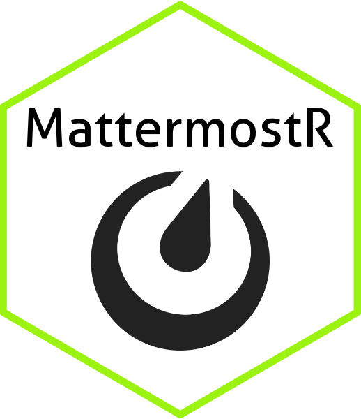

<!-- README.md is generated from README.Rmd. Please edit that file -->

# MattermostR <a href="https://github.com/GreenGrassBlueOcean/MattermostR"></a>

<!-- badges: start -->

[](https://github.com/GreenGrassBlueOcean/MattermostR/actions/workflows/R-CMD-check.yaml)
[](https://app.codecov.io/gh/GreenGrassBlueOcean/MattermostR)

<!-- badges: end -->

MattermostR is an R package for interacting with the [Mattermost REST
API v4](https://api.mattermost.com/). It covers messaging, file
management, channel and team administration, reactions, bots, slash
commands, and more.

## Installation

``` r
# Install from GitHub
devtools::install_github("GreenGrassBlueOcean/MattermostR")
```

## Authentication

Authenticate with a bearer token (recommended) or username/password.
Credentials are resolved from environment variables first, then R
options.

``` r
# Token-based (recommended)
auth <- authenticate_mattermost(
  base_url = "https://your-mattermost.example.com",
  token    = "your-token"
)

# Or store credentials in environment variables to avoid passing auth everywhere:
# MATTERMOST_URL=https://your-mattermost.example.com
# MATTERMOST_TOKEN=your-token
```

## Sending Messages

### Basic message

``` r
send_mattermost_message(
  channel_id = "your-channel-id",
  message    = "Hello, Mattermost!",
  auth       = auth
)
```

### Message with priority

``` r
send_mattermost_message(
  channel_id = "your-channel-id",
  message    = "Urgent update!",
  priority   = "Urgent",   # "Normal" (default), "Important", or "Urgent"
  auth       = auth
)
```

### Reply in a thread

``` r
send_mattermost_message(
  channel_id = "your-channel-id",
  message    = "This is a thread reply.",
  root_id    = "parent-post-id",
  auth       = auth
)
```

### Attach a file or plot

``` r
library(ggplot2)

p <- ggplot(mtcars, aes(wt, mpg)) + geom_point()

send_mattermost_message(
  channel_id = "your-channel-id",
  message    = "Here is the plot.",
  plots      = list(p),
  auth       = auth
)
```

### Incoming webhooks (no auth required)

``` r
send_webhook_message(
  webhook_url = "https://your-mattermost.example.com/hooks/your-hook-id",
  message     = "Automated notification from R."
)
```

## Managing Posts

``` r
# Edit an existing post
update_post(post_id = "post-id", message = "Corrected text.", auth = auth)

# Delete a post
delete_post(post_id = "post-id", auth = auth)

# Delete all posts in a channel older than a given date
delete_old_messages(
  channel_id = "your-channel-id",
  before_date = "2024-01-01",
  auth = auth
)
```

## Reactions & Pins

``` r
# Emoji reactions
add_reaction(post_id = "post-id", emoji_name = "thumbsup", auth = auth)
get_reactions(post_id = "post-id", auth = auth)
remove_reaction(post_id = "post-id", emoji_name = "thumbsup", auth = auth)

# Pin / unpin a post
pin_post(post_id = "post-id", auth = auth)
unpin_post(post_id = "post-id", auth = auth)
```

## Searching and Retrieving Posts

``` r
# Retrieve posts from a channel (paginated)
posts <- get_channel_posts(channel_id = "your-channel-id", auth = auth)

# Search message history
results <- search_posts(
  terms       = "important update",
  team_id     = "your-team-id",
  in_channels = "your-channel-id",
  after_date  = "2024-01-01",
  auth        = auth
)
```

## Managing Channels

``` r
# List channels in a team
channels <- get_team_channels(team_id = "your-team-id", auth = auth)

# Look up a channel ID by name
channel_id <- get_channel_id_lookup(channels, name = "town-square")

# Create channels
create_channel(
  team_id      = "your-team-id",
  name         = "new-channel",
  display_name = "New Channel",
  auth         = auth
)

# Direct message or group message channel
create_direct_channel(user_ids = c("user-id-1", "user-id-2"), auth = auth)

# Delete a channel
delete_channel(channel_id = "channel-id", team_id = "your-team-id", auth = auth)

# Channel membership
add_user_to_channel(channel_id = "channel-id", user_id = "user-id", auth = auth)
add_users_to_channel(channel_id = "channel-id", user_ids = c("uid1", "uid2"), auth = auth)
get_channel_members(channel_id = "channel-id", auth = auth)
remove_channel_member(channel_id = "channel-id", user_id = "user-id", auth = auth)
```

## Teams and Users

``` r
# Teams
teams   <- get_all_teams(auth = auth)
team    <- get_team(team_id = "your-team-id", auth = auth)

# Users
me      <- get_me(auth = auth)
user    <- get_user(user_id = "user-id", auth = auth)
all_users <- get_all_users(auth = auth)

# User status
get_user_status(user_id = "user-id", auth = auth)
set_user_status(user_id = "user-id", status = "away", auth = auth)
```

## Files

``` r
# Download a file
get_mattermost_file(file_id = "file-id", dest_path = "local/file.png", auth = auth)
```

## Bots

``` r
bot <- create_bot(username = "mybot", display_name = "My Bot", auth = auth)
get_bots(auth = auth)
disable_bot(bot_user_id = bot$user_id, auth = auth)
enable_bot(bot_user_id = bot$user_id, auth = auth)
```

## Slash Commands

``` r
cmd <- create_command(
  team_id      = "your-team-id",
  trigger      = "remind",
  url          = "https://your-handler.example.com/remind",
  display_name = "Remind",
  auth         = auth
)

list_commands(team_id = "your-team-id", auth = auth)
delete_command(command_id = cmd$id, auth = auth)
```

## Error Handling

By default, HTTP errors raise a `mattermost_error` condition (stops
execution). Switch to the legacy silent mode if you prefer `NULL`
returns:

``` r
options(MattermostR.on_error = "message")
```

## License

MIT
